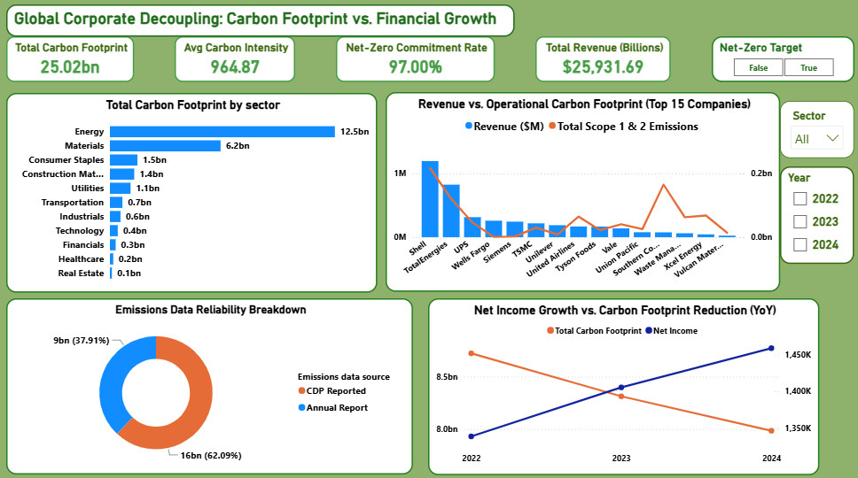

# Global Corporate Decoupling: Carbon Footprint vs. Financial Growth

An interactive Power BI dashboard designed to analyze whether the global economy is successfully growing financially while shrinking its corporate carbon footprint. 

## 🔗 Live Interactive Dashboard
👉 **[Click Here to View the Live Interactive Dashboard](https://app.powerbi.com/view?r=eyJrIjoiZjdkOTFjNDAtZDgzYy00NzRiLTk0MDAtODZjNzYzODczYzc3IiwidCI6IjdiYTdhM2JkLTc2MzYtNGY1ZC04MTFmLTYxNzExNWViMDBhMiJ9)**  
*(No Power BI installation required. Fully interactive via your web browser.)*

## 📊 Project Overview & Business Value
This dashboard functions as a strategic "sustainability progress report" for corporate entities. It aims to prevent massive organizations from being unfairly penalized for high total emissions due to sheer scale, instead evaluating environmental footprint metrics side-by-side with financial metrics like Revenue and Net Income.

### Key Insights Delivered:
* **Macro Decoupling Trends:** Tracks Year-over-Year (YoY) progress showing if emissions are dropping as Net Income scales.
* **Sector Diagnostics:** Pinpoints which global sectors (e.g., Energy, Materials) dominate the carbon footprint.
* **Efficiency vs. Scale:** Examines individual company revenues against their operational scope emissions.
* **Data Integrity Audit:** Tracks data transparency by showing the proportion of reported vs. estimated disclosures.

## 🛠️ Tech Stack & DAX Features
* **Tool:** Power BI Desktop / Power BI Service
* **Data Modeling:** Star schema architecture containing organizational financial records and Scope 1, 2, and 3 emissions tracking.
* **Advanced DAX Capabilities:**
  * **Dynamic Selection Metrics:** Implemented a robust `SWITCH` and `ISFILTERED` state pattern to allow the `Net-Zero Commitment Rate` KPI to dynamically flip between target adoption (97%) and target laggards (3%) depending on slicer states without calculation errors.
  * **Dynamic Visual Formatting:** Configured context-aware conditional titles to keep the user interface clear and intuitive during user interaction.

## 📈 Dashboard Preview
*(Tip: Take a screenshot of your beautiful dashboard, upload it to this GitHub repository, and reference it here so recruiters see it instantly.)*

## 📁 Repository Structure
* `Global_Sustainability_&_Financial_Decoupling_Analysis.pbix`: Main Power BI workbook file.
* `README.md`: Project documentation and live link portal.# Corporate-Carbon-Decoupling-Dashboard
An interactive Power BI dashboard exploring the decoupling of corporate financial growth from greenhouse gas emissions
